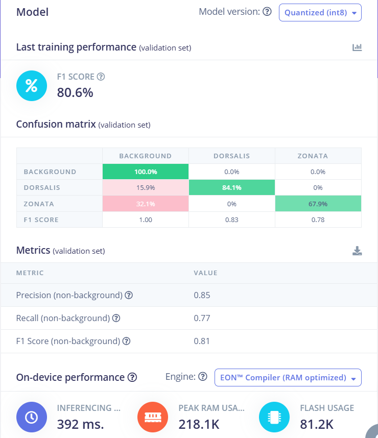
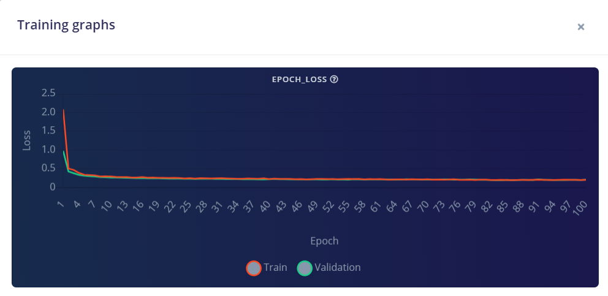
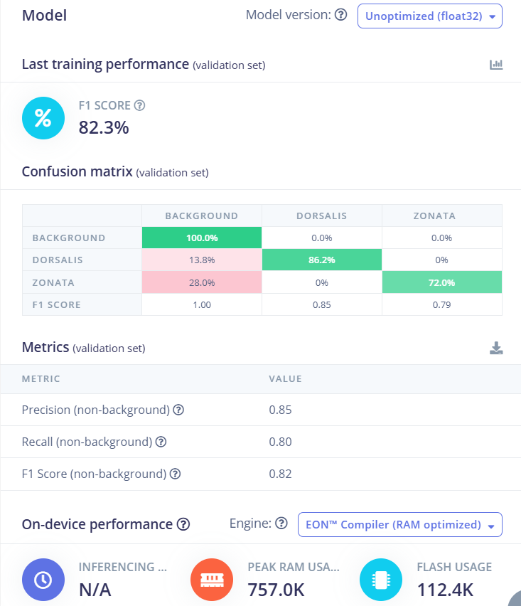
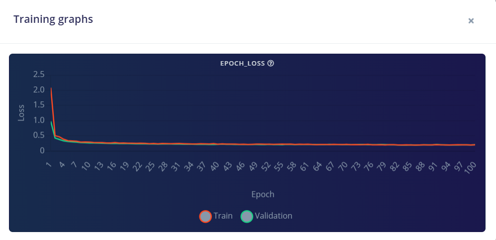
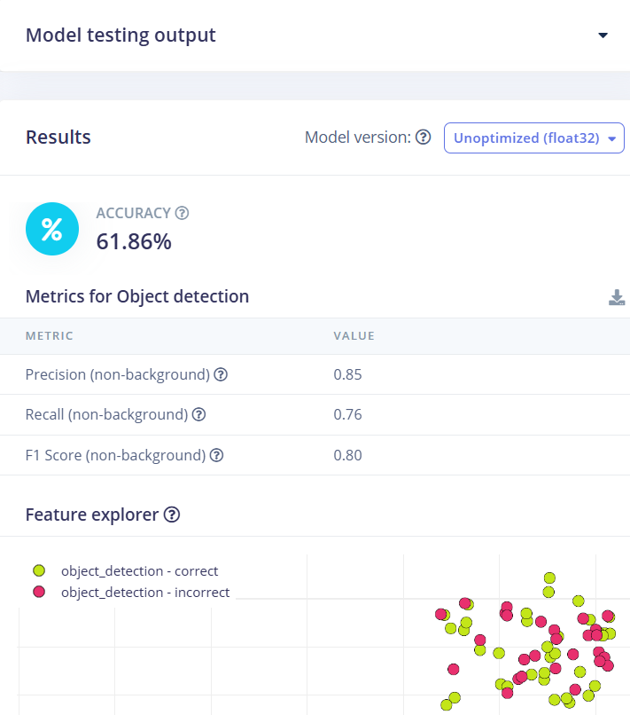
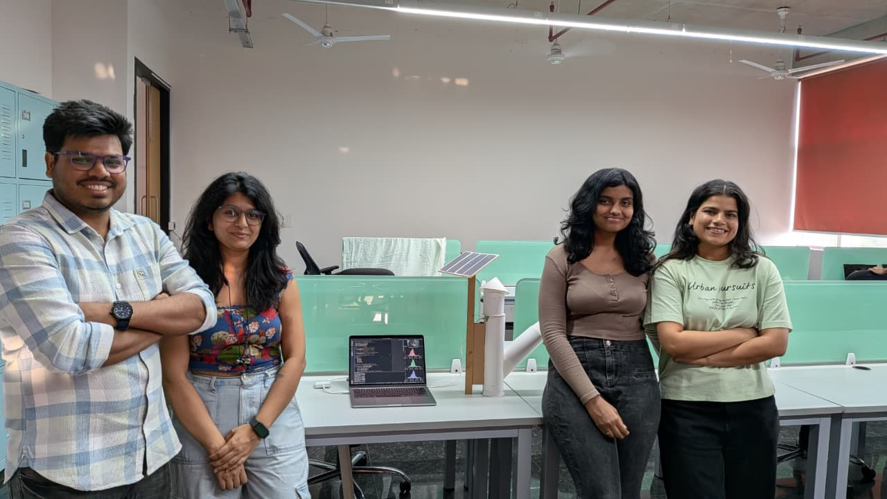

# Smart-trap-for-pest-detection-using-edge-ai


## 📁 Repository Structure

```text
.
├── dataset/               # Data images
├── models/                # model file to deploy on nicla vision
├── images/                # Photos of the prototype and model graphs
└── README.md              # Project overview and documentation (this file)
````

---

## 1. Problem Statement, Motivation & Objectives

Fruit flies such as *Bactrocera dorsalis* and *Bactrocera zonata* are major agricultural pests causing significant crop losses in fruits like mango and guava. These pests lay eggs inside fruits, making early detection difficult and leading to economic losses ranging from 40–80%. Traditional monitoring methods such as pheromone traps and manual counting are labor-intensive, time-consuming, and inefficient.

Motivated by the need for sustainable and automated pest monitoring, this project proposes an Edge AI-based solution for real-time detection of fruit flies. Unlike cloud-based systems, Edge AI enables low-latency, privacy-preserving, and energy-efficient inference directly on embedded devices like Arduino Nicla Vision.

### 🎯 Objectives:
- Detect and classify fruit fly species (dorsalis, zonata) in real time  
- Enable automated pest monitoring using smart traps  
- Reduce reliance on chemical pesticides  
- Deploy lightweight AI models on edge devices  
- Provide real-time detection outputs for further automation  

---

## 2. Proposed Solution (Overview)

This project implements an AI-powered smart pest detection system using a FOMO (Faster Objects, More Objects) model deployed on Arduino Nicla Vision.

### 🔄 Pipeline:

- Camera captures real-time images  
- Edge Impulse FOMO model processes images  
- Outputs pest class + position + confidence  
- Data displayed via serial monitor  

---

## 3. Hardware & Software Setup

### 🧱 Hardware:
- Arduino Nicla Vision (Edge AI device with camera)  
- Custom-built pest trap structure (funnel mechanism)  
  

### 💻 Software:
- Edge Impulse (model training & deployment)  
- Arduino IDE (deployment & serial monitoring)  
- FOMO model (lightweight object detection)  

---

## 4. Data Collection & Dataset Preparation

- Dataset sourced from research paper dataset: https://data.mendeley.com/datasets/hgz2n5jxhp/1  (publicly available)
- Focused on 3 classes:
  - Bactrocera dorsalis  
  - Bactrocera zonata
  - Background class: added by edge impulse means no insect

### 📊 Dataset Details:
- ~500 images used (subset of larger dataset)  
- Images include lab + field conditions


---
## 5. Model Design, Training & Evaluation

## 🧠 Model Design: FOMO for TinyML

We use **Edge Impulse FOMO (Faster Objects, More Objects)** for TinyML-based object detection.

### Model Architecture

* Backbone: **MobileNetV2 0.35** (lightweight CNN)
* Detection head: **FOMO** (grid-based object detection)
* Designed to provide **class + approximate location** while fitting into a **microcontroller** memory and compute budget.

### Input Configuration

* Input image: **128 × 128 RGB**
* Flattened feature dimension: **49,152**

### Output Classes

The model predicts **2 object classes** (non-background):
  - Bactrocera dorsalis  
  - Bactrocera zonata  


---

## 🧪 Training Details (Edge Impulse)

The Keras-based object detection block in Edge Impulse uses a **FOMO-specific training script** with:

* **Loss:** Weighted cross-entropy (using `object_weight` to emphasize objects vs. background)
* **Epochs:** `100`
* **Learning rate:** `0.001`
* **Batch size:** `32`
* **Backbone width multiplier (alpha):** `0.35`
* **Checkpointing:** Best weights selected based on **validation F1 score (`val_f1`)**

After training, an explicit **softmax** layer is added to ensure per-cell probabilities are properly normalized.

### 🛠️ Preprocessing:
- Image labeling (bounding boxes → converted to FOMO grid)  
- Data cleaning  
- Class balancing (limited dataset)  


## 📊 Model Compression & Performance


- The trained model was evaluated in both **quantized (int8)** and **unoptimized (float32)** formats to assess its suitability for deployment on edge devices like Arduino Nicla Vision.
- Lightweight architecture (FOMO instead of YOLO)  

### ⚙️ Quantized Model (int8)
- **Latency:** ~395 ms  
- **RAM Usage:** ~409 KB  
- **Flash Usage:** ~70.9 KB
  




### 🔹 Class-wise Performance
- **Bactrocera dorsalis:** 84.1% accuracy (F1: 0.83)  
- **Bactrocera zonata:** 67.9% accuracy (F1: 0.78)  

### 🔹 Confusion Analysis
- The model performs better on *dorsalis* compared to *zonata*  
- Around **32% of zonata samples are misclassified as background**  
- This is due to visual similarity and limited dataset size  

This version is optimized for microcontrollers and enables real-time inference with low memory consumption.

### ⚠️ Unoptimized Model (float32)
- **RAM Usage:** ~1.5 MB  
- **Accuracy:** 61.86%  



The float32 model requires significantly higher memory and is not suitable for deployment on resource-constrained devices.

### 📌 Insight
Quantization reduces model size and memory usage drastically, enabling efficient edge deployment with a minor trade-off in accuracy.

## 7. Model Deployment & On-Device Performance

### 🚀 Deployment Steps:
- Train model on Edge Impulse  
- Export as Arduino library  
- Flash onto Nicla Vision  

### 📟 On-device Output:



### 🔹 Test Accuracy
- **Accuracy:** 61.86%  


### ⚙️ Performance:
- Real-time inference on device  
- No internet required  
- Continuous frame-by-frame detection  

---

## 8. System Prototype 

### 🧱 Hardware Prototype

- Smart trap prototype
   

- Arduino Nicla vision mounted for detection

The developed prototype consists of a cylindrical pest trap with a funnel-based entry mechanism to capture insects. The camera (Nicla Vision) is mounted strategically to monitor the internal chamber for real-time pest detection.

### ☀️ Solar-Powered System (Sustainability Innovation)

A key enhancement of this system is the integration of a **solar panel-based power supply**, making the solution energy-efficient and suitable for remote agricultural environments.

#### 🔋 Working:
- Solar panel captures sunlight and converts it into electrical energy  
- Energy can be used directly or stored in a battery  
- Powers the Arduino Nicla Vision for continuous operation  

#### 🌱 Advantages:
- Renewable and eco-friendly energy source  
- Eliminates dependency on external power supply  
- Enables deployment in remote farms  
- Reduces operational cost  
- Supports sustainable agriculture practices  

> This integration makes the system a **self-sustaining smart pest monitoring solution**, combining Edge AI with renewable energy.

---

## 9. Conclusions & Limitations

### ✅ Conclusions:
- Successfully implemented Edge AI pest detection system  
- Real-time classification achieved on embedded device  
- Demonstrates feasibility of smart agriculture using AI  

### ⚠️ Limitations:
- Small dataset (~500 images)  
- Lighting sensitivity   
- No automatic pest removal system  

---

## 10. Future Work

- Add automatic trap mechanism (fan/suction)  
- Develop cloud dashboard for monitoring  
- Improve dataset size and diversity  
- Implement pest counting logic  
- Integrate IoT for remote alerts  

---

## 11. Challenges & Mitigation

### ⚠️ Challenges:
- Limited dataset  
- Model accuracy vs device constraints  
- Lighting variations  
- Repeated detections  

### ✅ Solutions:
- Used FOMO model for efficiency  
- Applied confidence threshold filtering  
- Optimized model for edge deployment  
- Improved labeling and preprocessing  

---

## 📚 References

- Hakim, A., Srivastava, A.K., Hamza, A. et al. Yolo-pest: an optimized YoloV8x for detection of small insect pests using smart traps. Sci Rep 15, 14029 (2025). https://doi.org/10.1038/s41598-025-97825-3
- Dataset: https://data.mendeley.com/datasets/hgz2n5jxhp/1  (obtained from same paper)
---

## 🧠 Key Innovation

> This project replaces heavy cloud-based AI models with a lightweight Edge AI system, enabling real-time, low-power, and scalable pest monitoring directly in agricultural fields.


You can explore the full impulse design and training configuration here:

👉 **Public Edge Impulse Project:**
[Link](https://studio.edgeimpulse.com/public/978052/latest)

---

## 👥 Team



(L to R in above image)

* **Vishal Kumar Verma** 
* **Suruchi Singh**
* **Ragavi Saravanan**
* **Vidushi Chauhan**
* **Mentor:** Prof. Pandarasamy Arjunan, RBCCPS, Indian Institute of Science.

## 🎬 Demo (Real-Time Detection)

[Watch Video](https://drive.google.com/file/d/1K4FhcsBA7uPIIPDK51qnXIg_3JbTPAKb/view)

For questions, feedback, or collaboration opportunities, please contact: **[samy@iisc.ac.in](mailto:samy@iisc.ac.in)**
Course link: https://www.samy101.com/edge-ai-26/

