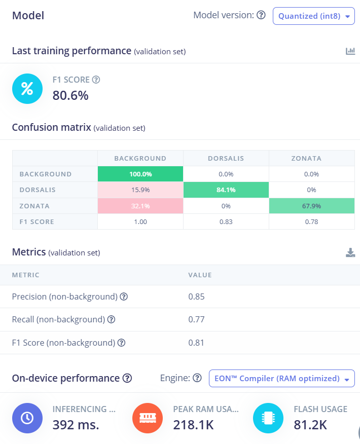
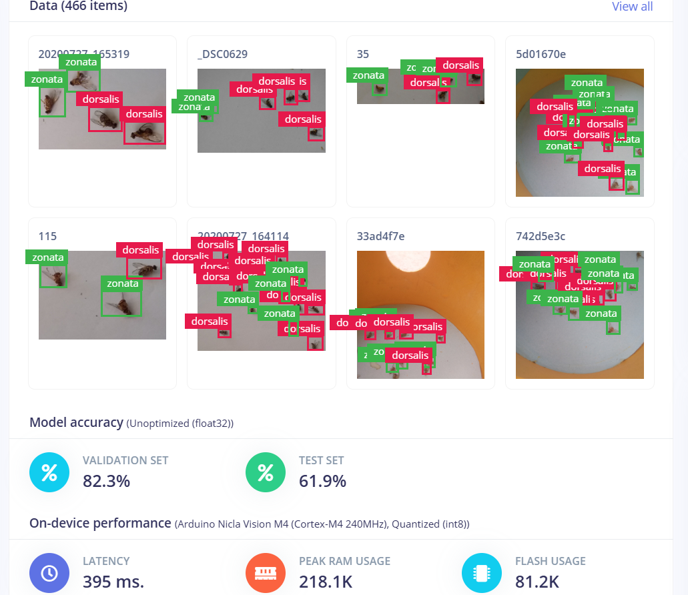
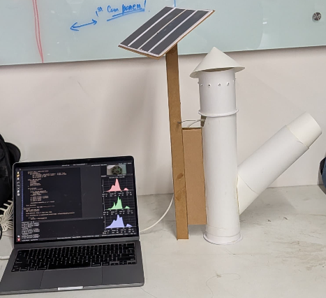

# Smart-trap-for-pest-detection-using-edge-ai

## 1. Problem Statement, Motivation & Objectives

Fruit flies such as *Bactrocera dorsalis* and *Bactrocera zonata* are major agricultural pests causing significant crop losses in fruits like mango and guava. These pests lay eggs inside fruits, making early detection difficult and leading to economic losses ranging from 40–80%. Traditional monitoring methods such as pheromone traps and manual counting are labor-intensive, time-consuming, and inefficient.

Motivated by the need for sustainable and automated pest monitoring, this project proposes an Edge AI-based solution for real-time detection of fruit flies. Unlike cloud-based systems, Edge AI enables low-latency, privacy-preserving, and energy-efficient inference directly on embedded devices like Arduino Nicla Vision.

### 🎯 Objectives:
- Detect and classify fruit fly species (dorsalis, zonata) in real time  
- Enable automated pest monitoring using smart traps  
- Reduce reliance on chemical pesticides  
- Deploy lightweight AI models on edge devices  
- Provide real-time detection outputs for further automation  

---

## 2. Proposed Solution (Overview)

This project implements an AI-powered smart pest detection system using a FOMO (Faster Objects, More Objects) model deployed on Arduino Nicla Vision.

### 🔄 Pipeline:

- Camera captures real-time images  
- Edge Impulse FOMO model processes images  
- Outputs pest class + position + confidence  
- Data displayed via serial monitor  

---

## 3. Hardware & Software Setup

### 🧱 Hardware:
- Arduino Nicla Vision (Edge AI device with camera)  
- Custom-built pest trap structure (funnel mechanism)  
- USB connection for data monitoring  

### 💻 Software:
- Edge Impulse (model training & deployment)  
- Arduino IDE (deployment & serial monitoring)  
- FOMO model (lightweight object detection)  

---

## 4. Data Collection & Dataset Preparation

- Dataset sourced from research paper dataset (publicly available) :contentReference[oaicite:1]{index=1}  
- Focused on 2 classes:
  - Bactrocera dorsalis  
  - Bactrocera zonata  

### 📊 Dataset Details:
- ~500 images used (subset of larger dataset)  
- Images include lab + field conditions  

### 🛠️ Preprocessing:
- Image labeling (bounding boxes → converted to FOMO grid)  
- Data cleaning  
- Class balancing (limited dataset)  

---

## 5. Model Design, Training & Evaluation

### 🧠 Model:
- Type: FOMO (lightweight CNN-based object detection)  
- Designed for edge devices  

### ⚙️ Training:
- Platform: Edge Impulse  
- Train/Test split applied  
- Optimized for low memory  

### 📈 Evaluation:
- Metric: Confidence score (0–1)  
- Typical results:
  - 0.6–0.75 confidence (real-time detection)  
- Trade-off:
  - Lower accuracy vs high efficiency  

---

## 6. Model Compression & Efficiency Metrics

### ⚡ Techniques:
- Quantization (8-bit model for edge deployment)  
- Lightweight architecture (FOMO instead of YOLO)  

## 📊 Model Performance (Edge Impulse - Validation Set)

### 🔍 Key Metrics:
- **F1 Score (Overall):** 80.6%  
- **Precision (non-background):** 0.85  
- **Recall (non-background):** 0.77  
- **F1 Score (non-background):** 0.81  

### 🧠 Class-wise Performance:
- **Bactrocera dorsalis:** 84.1% accuracy (F1: 0.83)  
- **Bactrocera zonata:** 67.9% accuracy (F1: 0.78)  

### ⚙️ On-Device Performance (Nicla Vision):
- **Inference Time:** ~392 ms  
- **Peak RAM Usage:** 218.1 KB  
- **Flash Usage:** 81.2 KB  
- **Model Type:** Quantized (int8, EON Compiler optimized)  

### 📌 Insights:
- The model performs well for *dorsalis* but shows moderate confusion with *zonata* due to visual similarity.  
- Quantization enables efficient deployment on microcontrollers with minimal memory and power usage.  

### ⚖️ Trade-offs:
- Faster inference but lower precision compared to YOLO  
- Suitable for real-time embedded systems  

---

## 7. Model Deployment & On-Device Performance

### 🚀 Deployment Steps:
- Train model on Edge Impulse  
- Export as Arduino library  
- Flash onto Nicla Vision  

### 📟 On-device Output:

### ⚙️ Performance:
- Real-time inference on device  
- No internet required  
- Continuous frame-by-frame detection  

---

## 8. System Prototype 

### 🧱 Hardware Prototype

- Smart trap prototype  
- Arduino Nicla vision mounted for detection

The developed prototype consists of a cylindrical pest trap with a funnel-based entry mechanism to capture insects. The camera (Nicla Vision) is mounted strategically to monitor the internal chamber for real-time pest detection.

### ☀️ Solar-Powered System (Sustainability Innovation)

A key enhancement of this system is the integration of a **solar panel-based power supply**, making the solution energy-efficient and suitable for remote agricultural environments.

#### 🔋 Working:
- Solar panel captures sunlight and converts it into electrical energy  
- Energy can be used directly or stored in a battery  
- Powers the Arduino Nicla Vision for continuous operation  

#### 🌱 Advantages:
- Renewable and eco-friendly energy source  
- Eliminates dependency on external power supply  
- Enables deployment in remote farms  
- Reduces operational cost  
- Supports sustainable agriculture practices  

> This integration makes the system a **self-sustaining smart pest monitoring solution**, combining Edge AI with renewable energy.

---

## 9. Conclusions & Limitations

### ✅ Conclusions:
- Successfully implemented Edge AI pest detection system  
- Real-time classification achieved on embedded device  
- Demonstrates feasibility of smart agriculture using AI  

### ⚠️ Limitations:
- Small dataset (~500 images)  
- Lighting sensitivity   
- No automatic pest removal system  

---

## 10. Future Work

- Add automatic trap mechanism (fan/suction)  
- Develop cloud dashboard for monitoring  
- Improve dataset size and diversity  
- Implement pest counting logic  
- Integrate IoT for remote alerts  

---

## 11. Challenges & Mitigation

### ⚠️ Challenges:
- Limited dataset  
- Model accuracy vs device constraints  
- Lighting variations  
- Repeated detections  

### ✅ Solutions:
- Used FOMO model for efficiency  
- Applied confidence threshold filtering  
- Optimized model for edge deployment  
- Improved labeling and preprocessing  

---

## 📚 References

- Edge Impulse Project:  
https://studio.edgeimpulse.com/public/978052/latest 

- Hakim, A., Srivastava, A.K., Hamza, A. et al. Yolo-pest: an optimized YoloV8x for detection of small insect pests using smart traps. Sci Rep 15, 14029 (2025). https://doi.org/10.1038/s41598-025-97825-3
- Dataset: https://drive.google.com/drive/folders/18k9gkIcmcYhsyWR97ovj2kXOyMpKNC5l?usp=sharing
---

## 🧠 Key Innovation

> This project replaces heavy cloud-based AI models with a lightweight Edge AI system, enabling real-time, low-power, and scalable pest monitoring directly in agricultural fields.

##Team Members

